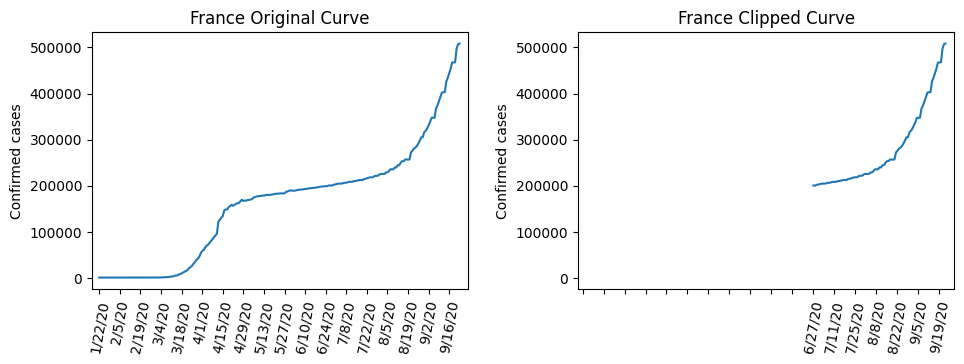

# COVID-19 Spread Analysis

This project analyzes the spread of the COVID-19 virus across countries based on factors like geographic position, urban population percentage, and climatic conditions.

## Motivation

[A previous study](https://www.kaggle.com/code/paultimothymooney/does-latitude-impact-the-spread-of-covid-19/notebook) examined the relationship between COVID-19 spread and latitude, but received criticism for not considering enough factors like urbanization levels and climate. This project aims to revisit that analysis by incorporating additional variables to better understand the key influencers of virus propagation.

## Data sources
- Urban population: https://data.worldbank.org/indicator/SP.URB.TOTL
- Total population: https://data.worldbank.org/indicator/SP.POP.TOTL
- Country position: https://gist.github.com/tadast/8827699#file-countries_codes_and_coordinates-csv
- Mean temperature: https://en.wikipedia.org/wiki/List_of_countries_by_average_yearly_temperature
- COVID confirmed cases: https://www.kaggle.com/datasets/sudalairajkumar/novel-corona-virus-2019-dataset/versions/143
- Climate classification: https://koeppen-geiger.vu-wien.ac.at/data/Koeppen-Geiger-ASCII.zip
- Mortality rate: https://www.kaggle.com/datasets/paultimothymooney/coronavirus-covid19-mortality-rate-by-country and https://www.worldometers.info/coronavirus/

## Notebooks

Here are the notebooks used in this project and their purpose:

1. `clipping_curves.ipynb`: Truncates the COVID-19 case curves to isolate the period of unmitigated spread.
2. `spread_rate.ipynb`: Explores several methods to calculate the spread rate from the truncated curves.
3. `data_exploration.ipynb`: Explores each feature in the dataset individually.
4. `position.ipynb`: Explores the relationship between geographic position and spread rate.
5. `urbanization.ipynb`: Explores the relationship between the ratio of urban population and spread rate.
6. `climate.ipynb`: Explores the relationship between climate classification/mean temperature and spread rate.

## Data Processing

The data processing steps include:

1. **Country Selection**: A subset of 159 countries was selected for which all required data was available across the different sources. The difflib library was used to match country names across datasets by calculating similarity scores, using a threshold of 0.8.

2. **Geographic Positions**: The average latitude and longitude for each country was obtained from Tadas Talaikis' dataset, which provides the mean geographic position.

3. **Climate Data**:
   - **Temperature**: Mean temperature data for each country was extracted from Wikipedia.

    

    

   - **Climate Classification**: The Köppen-Geiger climate classification was obtained from the University of Vienna's dataset, which provides climate data for over 90,000 points globally. For each country, the nearest point was identified by calculating the distance using the Haversine formula, and the corresponding climate classification was assigned.

1. **Population Data**:
   - The total population and urban population figures for 2020 were retrieved from the World Bank dataset.
   - The urban population percentage was calculated by dividing the urban population by the total population.

   

5. **COVID-19 Data**:
   - **Confirmed Cases**: The cumulative confirmed COVID-19 cases were obtained from Kaggle and Worldometers, available as a time series with daily data points. For countries with multiple regions, the cases were summed up.
   - **Mortality Rate**: The mortality rate was calculated by dividing the number of deaths by the number of confirmed cases and multiplying by 100 to get a percentage.

6. **Time Series Truncation**: Described below.

The final dataset contained the following features for each country:

- Country name
- Latitude and longitude
- Urban and total population
- Mortality rate
- Mean temperature
- Climate classification
- Truncated COVID-19 confirmed cases time series

## Analysis

### Time Series Truncation

To extract a comparable spread indicator across countries, the COVID-19 case time series were truncated to isolate periods of largely unmitigated viral spread, before government interventions became highly impactful.

The time series were first smoothed using a moving average.

    

The derivatives of the smoothed curves were then calculated, and the maximum derivative point was located. Moving backwards and forwards from this point, the curves were truncated at points where the derivative fell below empirically chosen thresholds of 5% and 70% respectively.

    

### Spread Rate Calculation

Four methods were evaluated to calculate a single spread rate indicator from the truncated case curves:

1. Linear Regression  

      

   This proved to be a poor model for viral spread.

2. Exponential Regression

      

   Exponential regression provided a good fit and was selected as the spread indicator, after min-max scaling of coefficients.

3. Case Doubling Rate

    In order to make the result less sensitive to the initial conditions, the doubling rate was calculated as the average of the doubling rates on the last 75% of the time series.

   

    
   This method was considered but not used for the final analysis.

4. Daily Reproduction Ratio

   It corresponds to the mean relative increase in cases from one day to the next. It was calculated as the average of the daily reproduction ratios on the last 75% of the time series.
   The formula is: $R = \sum_{i=1}^{n-1} (C_{i+1} - C_i) / C_i$, where $C_i$ is the number of cases on day $i$.

   This method was considered but not used for the final analysis.

The spread rates calculated were then compared by visualizing on a common scale the ones for a diverse set of countries.

    

Here are the correlations between the different spread rate indicators:

| Indicator | Exponential Rate | Time to Double | Reproduction Ratio |
|-----------|------------------|----------------|--------------------|
| Exponential Rate | 1.00 | 0.43 | 0.78 |
| Time to Double | 0.43 | 1.00 | 0.61 |
| Reproduction Ratio | 0.78 | 0.61 | 1.00 |

For the rest of the analysis, I decided to consider the mean daily reproduction ratio as the main spread rate indicator since it's less sensitive to the shape of the curves.

## Results

### Comparison of Mortality Rate and Spread Rate
The analysis first compared the calculated spread rate with the mortality rate used in a previous study. 

    

It was found that the mortality rate and spread rate had quite different distributions, and the correlation between the two indicators was very low at 0.04. This confirmed that the mortality rate was not a good indicator of the virus's spread.

### Correlation with Geographic Position
The study attempted to reproduce the findings of a previous analysis that linked COVID-19 spread to latitude. While a weak correlation of 0.20 was found between absolute latitude and mortality rate, similar to the previous study, using the calculated spread rate resulted in an even lower correlation of 0.04.

    

The correlation with longitude was also negligible at 0.006. These results suggest that geographic position was not a determining factor in the spread of the virus.

### Correlation with Urban Population Share
The relationship between urban population percentage and the spread rate was examined.The correlation was found to be -0.08, indicating that the urban population share was not a strong predictor of viral propagation.

### Correlation with Climate
The study investigated the links between climate factors and the virus spread rate. Using the overall Köppen-Geiger climate classification, the correlation was very low at -0.02. Analyzing the individual components of the climate classification, such as main climate type, precipitation type, and temperature type, also resulted in weak correlations ranging from -0.09 to 0.09. 

   
   
   

Similarly, the average temperature of countries showed no correlation with the spread rate.

    

In summary, the results of this analysis were unable to identify any strong relationships between the virus spread rate and factors like geographic position, urban population share, or climatic conditions. This contradicts the findings of previous studies that had suggested latitude as a key determinant of COVID-19 propagation.

## Limitations

Some limitations of this study include:

- Data availability only at country level, lacks granular details
- Approximations required when merging data from different spatial resolutions
- The Köppen-Geiger climate classification data being available for specific geographic points, their assignment to countries implies some inaccuracy, as the climate can vary within the same country
- COVID-19 data also being primarily available at the country or large region level, this does not allow for sub-national analysis
- The lacking information on confirmed COVID-19 cases has made it difficult to determine a reliable spread rate indicator, as this type of analysis is usually performed at the national level with precise data on government interventions